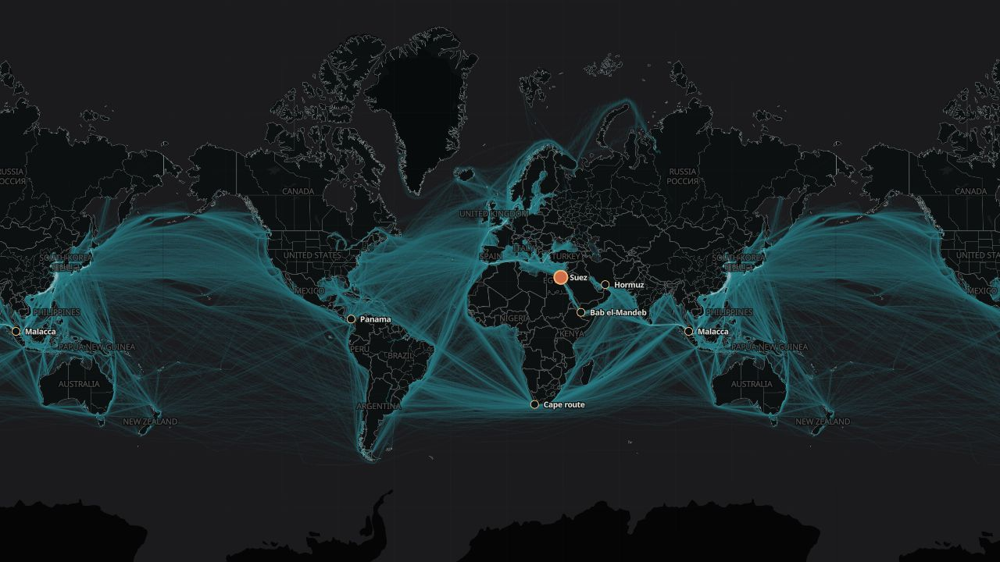

# Passage

[Passage](https://passage.lucasspeciale.com) is a static exploration of how global commercial-shipping corridors changed from January 2012 through July 2026. It combines monthly cargo-vessel presence from Global Fishing Watch with selected IMF PortWatch chokepoint histories.



## What it demonstrates

- A continuously wrapping MapLibre world with time-varying route-density fields
- Smooth monthly playback and rolling same-month, prior-year comparison
- A shared vector route spine that preserves corridor detail at close zoom
- Six named passages with high-resolution fields, fingerprints, and transit histories
- Demand-loaded static assets with no production API, database, or exposed credentials

Presence is an AIS-derived measure of activity, not unique vessels, cargo volume, or tonnage. PortWatch transit estimates are presented as a separate series and are never merged into the route-density scale.

The design and data decisions are documented in [PROJECT_PLAN.md](PROJECT_PLAN.md).

## Local development

Requires Node.js 20+ and pnpm 11.19.0.

```bash
pnpm install
pnpm dev
```

Open [http://localhost:3000](http://localhost:3000). Before handing off a change, run:

```bash
pnpm test
pnpm lint
pnpm build
```

The production build is a static export in `out/`.

## Architecture

The production application is browser-only. Expensive raster aggregation, reprojection, route extraction, and validation happen locally; the browser loads only the current, adjacent, and comparison assets.

```text
GFW reports + PortWatch snapshot
               ↓ offline Python build
Validated WebP and JSON partitions
               ↓ static hosting
Next.js + React + MapLibre browser app
```

Global route textures are 2,048 × 2,048 Web Mercator WebP files derived from the 0.1° GFW archive. A shared vector route spine keeps corridors sharp at close zoom. Named-passage close-ups use separate 0.01° fields aggregated into identity-free monthly textures.

Each named passage also has a compact 2012–2026 fingerprint. Every vertical slice compresses a monthly field across the passage's principal route axis, revealing lane persistence, branching, and drift without implying vessel direction.

## Data build

Create a Python environment and install the pinned processing dependencies:

```bash
python3 -m venv .venv
.venv/bin/pip install -r requirements-data.txt
```

Raw source snapshots and their expected locations are documented under `data/raw/`. Rebuild deployable assets with:

```bash
pnpm data:build:world
pnpm data:build:details
```

Raw GeoTIFFs, CSV reports, source archives, and vessel identifiers remain local and are ignored by Git. Only validated, identity-free browser derivatives are published.

## Repository size and data packaging

The files under `public/data/passage/` are intentionally tracked because the static Cloudflare build has no external data-fetch step. They contain 175 global monthly route textures plus high-resolution passage-detail textures and account for most of the repository's size.

The application does not download that complete archive at runtime. It requests the current month, adjacent month, and comparison assets on demand. A future packaging revision could move the generated archive to object storage, but the current repository favors a self-contained, reproducible deployment.

## Interpretation and limitations

- GFW presence is standardized hourly AIS presence, not vessel counts, direction, cargo, or tonnage.
- PortWatch estimates begin in 2019 and are displayed separately from the GFW route surface.
- AIS coverage, reception, vessel classification, and reporting behavior vary across time and place.
- Density textures are aggregated and identity-free; no vessel identifiers are shipped.
- Change mode compares each month with the same month one year earlier and does not establish causation.
- Named-passage polygons are analytical windows, not legal boundary definitions.
- Recent source observations may be revised by their publishers.

## Repository guide

```text
src/app/                    Next.js entry point and visual system
src/components/             Explorer, map, timeline, guide, and story views
src/lib/                    Formatting, temporal, and story helpers with tests
scripts/                    Offline acquisition and data-build pipeline
data/raw/                   Ignored source snapshots plus tracked provenance notes
data/processed/             Ignored intermediate products
public/data/passage/        Deployable generated assets
docs/passage-preview.jpg    Repository preview image
.github/workflows/          Test, build, and Cloudflare deployment
```

## Data and attribution

- Route presence and fingerprints: [Global Fishing Watch public vessel-presence data](https://globalfishingwatch.org/platform-update/global-ais-vessel-presence-dataset/), CC BY-SA 4.0
- Chokepoint histories: [IMF PortWatch](https://portwatch.imf.org/), with attribution to the UN Global Platform and IMF PortWatch
- Main country geometry: [World Bank Official Boundaries](https://datacatalog.worldbank.org/search/dataset/0038272/world-bank-official-boundaries)
- Administrative lines: [Natural Earth](https://www.naturalearthdata.com/), public domain
- Basemap: [OpenFreeMap](https://openfreemap.org/) using OpenMapTiles and OpenStreetMap data

See [THIRD_PARTY_NOTICES.md](THIRD_PARTY_NOTICES.md) for licensing boundaries and transformation details.

## Deployment

Pushes to `main` run tests, lint, and the production build before deploying the Cloudflare Pages project `passage`. Production is available at [passage.lucasspeciale.com](https://passage.lucasspeciale.com).

## Source availability

This repository is published as portfolio source, not as an open-source project. Original code and visual design are copyright Lucas Speciale and are provided under the terms in [LICENSE](LICENSE). Third-party data and dependencies retain their respective licenses.
